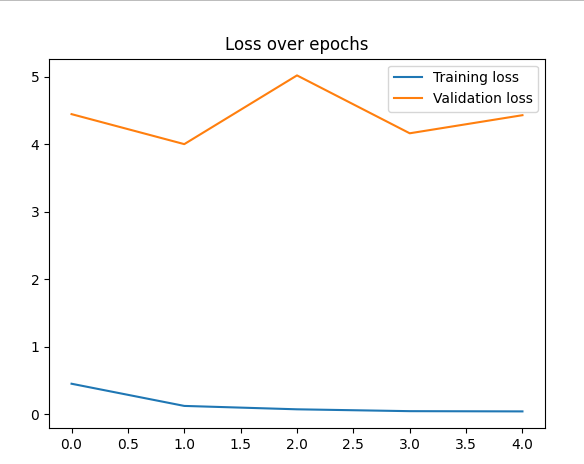

# USDA Beef Grade Classifier

This repository contains an AI model developed for the USDA's inaugural hackathon at Colorado State University. Utilizing PyTorch, the image classifier within this project aims to predict the beef grade of ribeye cuts between the twelfth and thirteenth ribs with moderate accuracy.

## Overview

The classifier operates based on USDA standards, which categorize beef grades into five tiers: Select, Low Choice, Standard, Upper 2/3 Choice, and Prime.

## Important Files and Directories:

### Files:

#### DataReader.csv:

CSV file containing image file names, carcass IDs, scores, and grade categories for the USDA-provided images. For this project, only the filename and grade columns were utilized.

#### FileReader.py:

Python script that corrects filenames from the CSV to accurately map them to files in the images directory. The corrected entries are stored in a new file called annotations.csv. This correction was necessary to provide the correct paths to the image classifier.

#### DataSeperator.py:

Python script that utilizes the updated annotations.csv file to divide images into training and validation sets. Images are placed into corresponding subdirectories based on their grade quality attribute extracted from the CSV file.

#### ImageClassifier.py:

Python script implementing the image classifier using PyTorch. It loops through the dataset's images multiple times, displaying the loss after each iteration.

#### Overview of functionality:

- Initializes datasets for training and validation, transforming each pixel value into a range between 0 and 1. The data is flattened into a long vector representing each image.

- Constructs a neural network to process the image vectors, reducing them to represent the five beef grades. The grade with the highest value is reported. This is achieved using PyTorch's default cross-entropy loss neural network.

- Trains the model by iterating through the training images, learning consistencies within beef grades. The process continues until completion based on the specified number of iterations.

### Directories:

#### Images:

Contains all USDA-provided images used for training and validation of the AI model. The directory comprises 14,000 images of ribeyes.

#### Training:

Created by DataSeperator.py, this directory holds the majority of images used for training the model. Images are organized into subdirectories based on their verified USDA rating label, facilitating continuous feedback on each prediction.

#### Validation:

Also created by DataSeperator.py, this directory contains 10% of the images for testing the model's accuracy after each training cycle.

#### Testing:

Contains raw images of ribeyes not seen during training, enabling evaluation of the model's ability to predict unseen images.

# Results

## Loss

